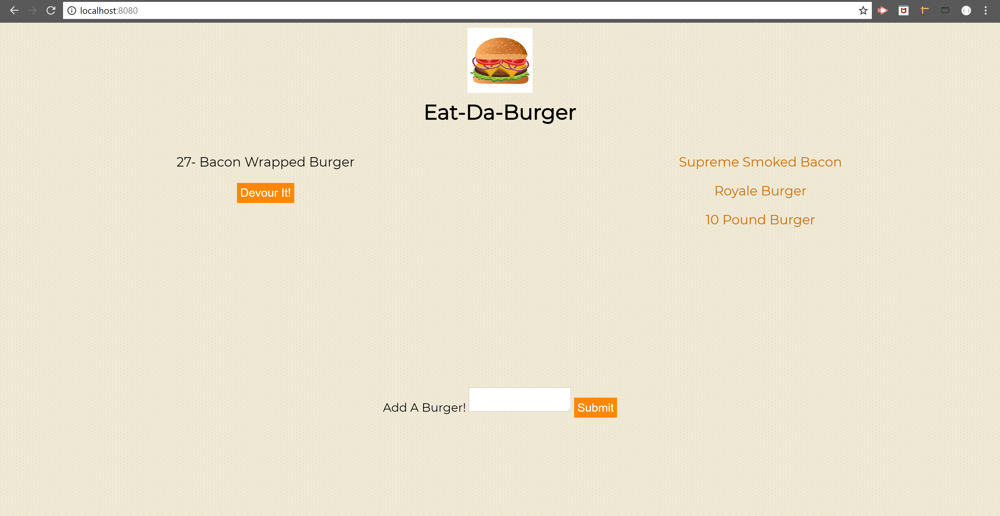

# Eat-Da-Burger Application

### Technologies used:
* Node.js
* Express
* Javascript
* Handlebars

## Home Page
This is the home page of the application and as you can see the URL is http://localhost:8080 wich means that the app is online running with the Express server we created. Basically on the left side the user will see the burgers to eat and on the right side the ones the user already ate. 

## Add New Burger
When the user fills the input, a new burger will be added to the left side with a new button called "Devour it!". Also, this new burger will be added to our MySql database.

## Devour It!
If the user clicks on the button, as you can see the burger will be moved to the right side with the list of devoured burgers. Also, this data will be updated on the MySql database.

